  

  
  
  
  

## 🚀 Featured projects

<table>
  <tr>
    <td width="50%" valign="top">
      <h3>🔗 <a href="https://github.com/salesmayn-code/LinkPulse">LinkPulse</a></h3>
      
Self-hostable URL shortener with protected analytics, link expiry, server-enforced ownership, and automated API/web tests.

      

        
        
        
        
      

    </td>
    <td width="50%" valign="top">
      <h3>🔍 <a href="https://github.com/salesmayn-code/Cryptojacking_Detection_Tool">CryptoDetect</a></h3>
      
Final-year project combining a Windows monitoring agent, ML detection, FastAPI backend, and React dashboard for real-time cryptojacking visibility.

      

        
        
        
        
      

    </td>
  </tr>
  <tr>
    <td width="50%" valign="top">
      <h3>🛡️ <a href="https://github.com/salesmayn-code/ShieldStack">ShieldStack</a></h3>
      
Hands-on DevSecOps roadmap connecting containers, infrastructure as code, security scanning, Kubernetes, GitOps, and observability.

      

        
        
        
        
      

    </td>
    <td width="50%" valign="top">
      <h3>🌐 <a href="https://github.com/salesmayn-code/portfolio">Developer Portfolio</a></h3>
      
Personal portfolio presenting my full-stack projects, technical background, experience, and growing DevOps direction.

      

        
        
        
      

    </td>
  </tr>
</table>

## 🧰 Technology stack

  
    
  

  
<b>🧭 How I am growing into DevSecOps</b>

   
  

    I am building on my full-stack foundation by learning how applications are containerized, tested, deployed, monitored, and secured. ShieldStack is the practical workspace for that journey: each phase turns a DevOps or security concept into something I can configure, run, test, and explain.
  

## 📊 GitHub activity

  

  

## 🐍 Contribution trail

  <picture>
    <source media="(prefers-color-scheme: dark)" srcset="https://raw.githubusercontent.com/salesmayn-code/salesmayn-code/profile-assets/snake-dark.svg" />
    <source media="(prefers-color-scheme: light)" srcset="https://raw.githubusercontent.com/salesmayn-code/salesmayn-code/profile-assets/snake.svg" />
    
  </picture>

---

  <b>Open to full-stack, backend, cloud, DevOps, and DevSecOps opportunities.</b>
    
  
  

